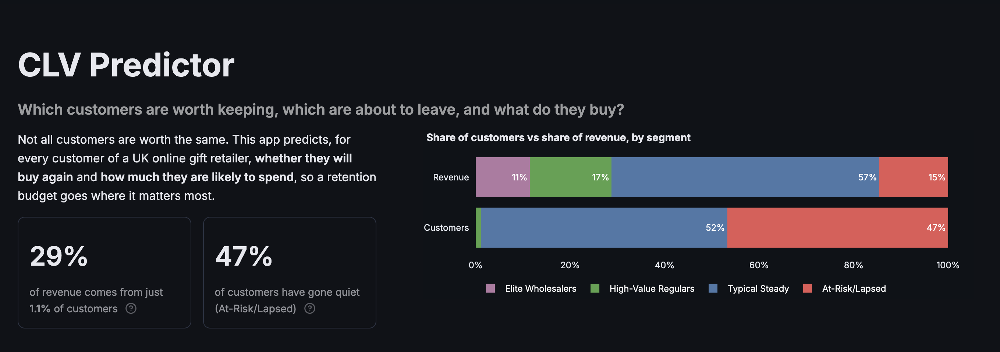
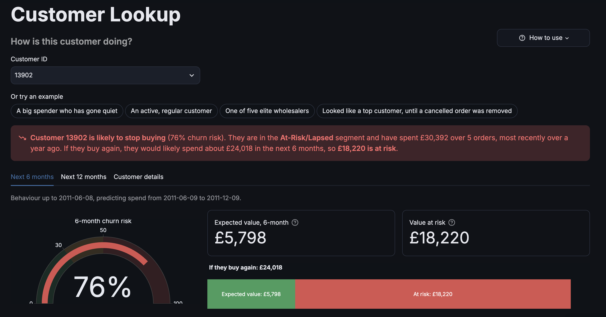
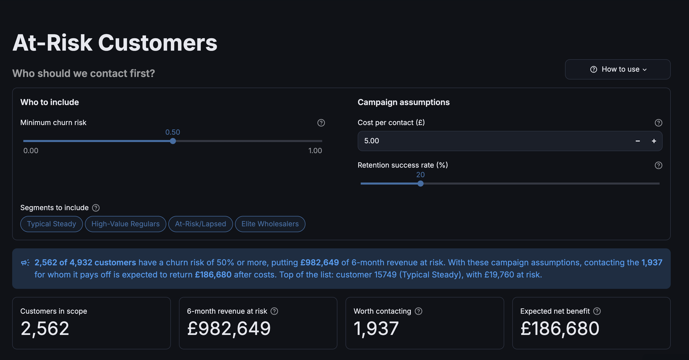

# Retail Customer Value

**Predicting customer churn and lifetime value for an online retailer**

**Live app: [retail-customer-value.streamlit.app](https://retail-customer-value.streamlit.app)**

An end-to-end machine learning project on two years of transactions from a UK online gift retailer. It predicts **whether each customer will buy again** (churn) and **how much they are likely to spend** (customer lifetime value, CLV), groups customers into segments, analyses which products sell, when, and together with what, and presents everything in an interactive Streamlit app built for a non-technical audience.

The project emphasises honest evaluation: models are selected by cross-validation rather than on the test set, every result in the app is checked live against the notebooks, and limitations and negative results are documented rather than hidden.



## What the app does

| Page | Question it answers |
|---|---|
| **Glossary** | What do these terms mean? Searchable definitions, plus interactive illustrations of snapshots and churn, expected value, and lift. |
| **Customer Lookup** | How is this customer doing? Churn risk, expected spend, and value at risk, summarised in one sentence. |
| **At-Risk Customers** | Who should we contact first? A retention list ranked by revenue at risk, with campaign costs and a CSV export. |
| **What-If Simulator** | What makes a customer valuable? Change a customer's behaviour and watch the predictions move. |
| **Segment Explorer** | What kinds of customers are there? Four segments, their revenue share, and an interactive customer map. |
| **Product Insights** | What sells, when, and with what? Top products, seasonality, "bought together" rules, and segment preferences. |
| **Model Info** | Can these predictions be trusted? Methodology, live performance checks, a calibration chart, and limitations. |

| Customer Lookup | At-Risk Customers |
|---|---|
|  |  |

## Approach and key results

**Data.** [Online Retail II](https://archive.ics.uci.edu/dataset/502/online+retail+ii) (UCI Machine Learning Repository): 1,067,371 transaction lines, December 2009 to December 2011. After removing duplicates, transactions without a customer, non-product entries (postage, manual adjustments, test products) and cancelled orders, 770,554 lines remain.

**Prediction setup.** Features are computed from an 18-month calibration period (to 2011-06-08) and the target is actual spend in the following 6 months, so every model is evaluated on genuinely future behaviour. A separate 12-month version uses a 12-month calibration window. Seven features per customer: recency, frequency, monetary value, average order value, tenure, distinct products, and average days between purchases.

**Churn model (Stage 1).** Nine algorithms were compared; all landed within a narrow band (test ROC-AUC 0.807 to 0.829), and an expanded hyperparameter search did not move it, which points to a ceiling set by the features rather than the modelling. The selected Gradient Boosting model reaches a cross-validated ROC-AUC of 0.805 (0.827 on the test set). 47.9% of customers made no purchase in the 6-month window.

**CLV model (two-stage).** Stage 1 estimates the churn probability *p*; Stage 2, trained only on customers who returned, estimates their spend *s*. The prediction is the expected value (1 - *p*) x *s*, so predictions are never negative and value at risk (*p* x *s*) is directly available. Two-stage, single-stage and classical (BG/NBD) approaches were compared by 5-fold out-of-fold predictions on the training set.

| 6-month CLV, final model | Out-of-fold (training) | Test set |
|---|---|---|
| MAE | £586.53 | £586.38 |
| R-squared | 0.847 | 0.618 |
| Predicted total / actual total | 99.9% | 112.3% |

**Segments.** K-Means on recency, frequency and spend gives four segments. The top two (Elite Wholesalers and High-Value Regulars) are 1.1% of customers but 28.8% of revenue; At-Risk/Lapsed customers are 46.8% of customers but 14.6% of revenue. DBSCAN and hierarchical clustering confirm the small high-value group and show the rest of the customer base as a continuous spectrum.

**Products.** 5,290 products analysed for revenue, seasonality and single-order concentration; 516 association rules from 30,611 UK baskets, with the strongest (lift above 40) rediscovering matching product sets purely from co-purchase data.

**New customers: a documented negative result.** A model predicting 90-day value from a customer's first order alone was tested and **not deployed**: the "will they return" classifier reached a ROC-AUC of only 0.595, and no model beat predicting the average by more than 5% of variance explained.

## Notable findings

- **Cancelled orders were being counted as revenue.** Dropping cancellation lines without removing the purchases they reversed left £730,406 of phantom revenue in the data. One order of £168,469.60, cancelled 12 minutes after it was placed, had become a customer's entire 6-month CLV target. Cancellations are now netted against the purchases they reversed (most recent first); 4 churn labels and 1,937 customers' spend values changed as a result.
- **Lowest error is not always the right objective.** A model predicting £0 for every customer above a churn threshold had the lowest average error, but its predictions added up to only 79% of actual revenue, because absolute error rewards predicting the median outcome rather than the mean. The expected value rule was chosen because its predictions add up to actual revenue (99.9%) and it can rank every customer.
- **Methodology fixes found by re-checking the pipeline:** the regression notebook was scoring the churn classifier on its own training customers (mismatched train/test splits); thresholds had been tuned on the test set; hardcoded cluster numbers silently mislabelled segments after re-clustering; and the new-customer target overlapped its features (leakage) and included customers whose history predates the dataset (left-censoring). All are corrected and documented in the notebooks.
- **Store closures are visible in the data:** empty bands in recency correspond exactly to Christmas and Easter closures, verified against trading days.

## Repository structure

```
clv-predictor/
├── app.py                  Streamlit entry point: page navigation
├── app_utils.py            Loading models, data and configs; CLV prediction logic
├── ui.py                   Shared page components (headers, gauges, customer summaries)
├── definitions.py          Glossary terms used for tooltips and the Glossary page
├── pages/                  The eight app pages
├── notebooks/              Analysis notebooks, run in order 1 to 10
├── src/                    Shared code: cleaning (cancellation netting), features, config, evaluation
├── models/                 Saved models and configuration files used by the app
├── data/                   Summary tables used by the app (raw and cleaned data are not committed)
├── .streamlit/config.toml  Light and dark themes
├── requirements.txt        App dependencies (pinned)
└── requirements-notebooks.txt  Additional dependencies for the notebooks
```

| Notebook | Purpose |
|---|---|
| `1_data_prep` | Cleaning, including cancellation netting |
| `2_eda` | Exploratory analysis and the RFM table |
| `3_feature_engineering` | Calibration and holdout split, features, CLV target |
| `4_classification` | Churn model comparison and selection |
| `5_regression` | 6-month CLV models and train-only model selection |
| `6_clustering` | Customer segmentation |
| `7_clv_12month` | 12-month churn and CLV models |
| `8_market_basket` | Association rules |
| `9_product_analysis` | Product performance, seasonality, segment preferences |
| `10_new_customer_scoring` | First-order value prediction (not deployed) |

## Running it locally

**The app** (the data and models it needs are in the repository). Python 3.12 is recommended, matching the pinned versions:

```bash
git clone https://github.com/SourodeepRoy30/clv-predictor.git
cd clv-predictor
python3.12 -m venv .venv
source .venv/bin/activate
pip install -r requirements.txt
streamlit run app.py
```

**The full pipeline** (rebuilds every data file and model from the raw dataset):

1. Install the notebook dependencies: `pip install -r requirements-notebooks.txt`
2. Download `online_retail_II.xlsx` from the [UCI repository](https://archive.ics.uci.edu/dataset/502/online+retail+ii) and place it in `data/`.
3. Run the notebooks in order, from `1_data_prep` to `10_new_customer_scoring`. Each saves the files the next one reads, and together they regenerate everything in `data/` and `models/` that the app uses.

## Limitations

The main ones, all explained on the app's Model Info page: churn prediction is capped at about 0.80 ROC-AUC by the available features; the linear Stage 2 can extrapolate for customers with unusually large orders and predicts £0 spend for some long-lapsed customers; single test sets are unstable on this heavy-tailed target, which is why models were chosen by cross-validation; and the data covers one UK retailer over two years.

## Data and acknowledgements

Online Retail II, created by Daqing Chen, UCI Machine Learning Repository: [archive.ics.uci.edu/dataset/502/online+retail+ii](https://archive.ics.uci.edu/dataset/502/online+retail+ii).

Built by **Sourodeep Roy** ([GitHub](https://github.com/SourodeepRoy30)).
